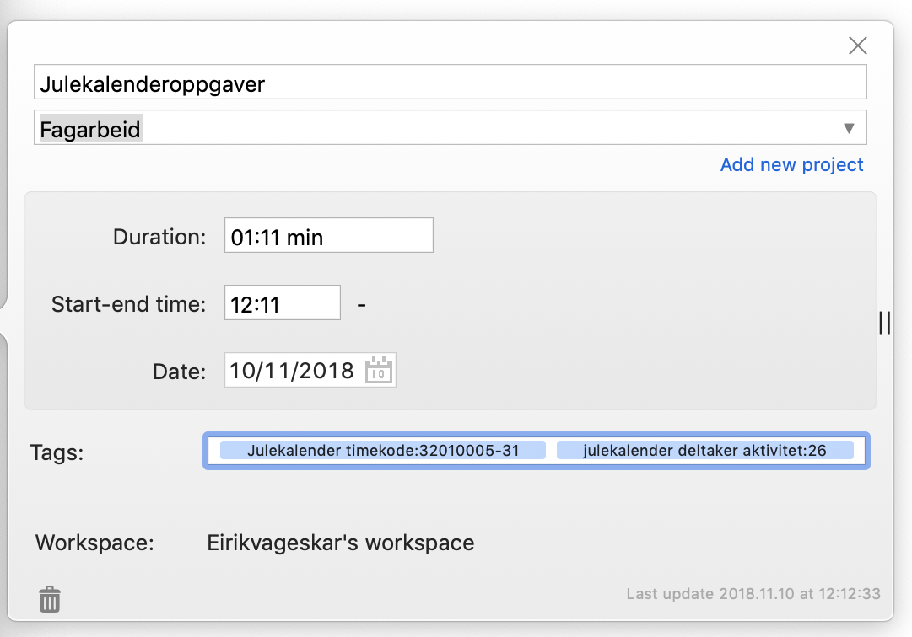
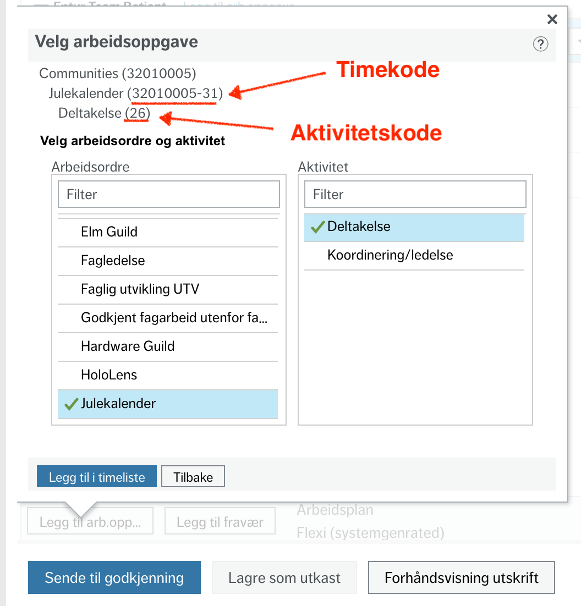

# Toggl til TSV
Konverterer Toggl-timer til en TSV som kan legges inn i [*Unngå UBW*](https://github.com/arve0/uubw).
Timene rundes av til nærmeste halvtime.
Tidsstykker fra samme dag med samme beskrivelse og timekode blir slått sammen.
*Alt du trenger gjøre er å stoppe og starte klokka.*

(&hellip; og å merke timene riktig. Se format lenger nede).

## Ansvarsfraskrivelse. Ved å bruke skriptet, anerkjenner du at du har lest denne.  
Vi som har laget dette skriptet har ikke noe ansvar for negative konsekvenser som følge av dets bruk, for eksempel feilfakturering og økonomisk tap.
Du er selv ansvarlig for at timelistene du sender inn er riktige.
Bruksveiledningen er å oppfatte som en beskrivelse av hvordan det er tenkt å fungere &ndash; ikke en garanti for at det faktisk vil fungere.

### Men sånn for å lette på stemninga (nå er det juridiske over) &hellip;
&hellip; vi har gjort vårt beste, altså!

## Bruk
Vi antar at du har installert Python3: `$ brew install python3`

Last ned en [detaljert rapport](https://toggl.com/app/reports/detailed/) som CSV fra Toggl: Velg tidsrommet og prosjektene som skal inn i timelisten, trykk «Export» og «Download as CSV». Så skriver du:

```
$ python3 ./convert_toggl_report.py <sti til csv-fil fra toggl> <sti til tsv-fil>
```

_Eksempel:_

```
python3 ./convert_toggl_report.py  ./__test__/Toggl_time_entries_2018-10-08_to_2018-10-14.csv ./ubw.tsv
```

## Merking av timer

### Eksempel
|Toggl desktop|UBW|
|-|-|
|||

### Beskrivelse
Beskrivelsen i UBW blir den samme som beskrivelsen du har ført i Toggl.
Den kan stort sett være hva du vil.
Unntatt når det kommer til fravær (se lenger nede).

### Timekode
Timekode-merkelapper må inneholde tekststrengen `timekode:` fulgt av UBW-timekoden.

Merkelappen kan også inneholde annen tekst, så lenge den kommer *før* `timekode:`.

*Eksempel:* `fagtid julekalender timekode:32010054-3`.

### Aktivitet
Aktivitet-merkelapper inneholder `aktivitet:` fulgt av UBW-aktivitetskoden.

Som med timekoder, kan du ha annen tekst i merkelappen så lenge den kommer *før* `aktivitet:`.

*Eksempel:* `julekalender deltaker aktivitet:26`.

### Fravær
For å merke noe som fravær må du merke den med `timekode:ABSENCE`.

*Unngå UBW* kommer til å søke på det som står i beskrivelsesfeltet, ned til hvert minste tegn. For eksempel må du reprodusere det manglende mellomrommet og andre særegenheter i `Lege, tannlege,fysioterapi besøk`.

Hvis enheten for fraværstypen føres i en annen enhet enn timer (for eksempel dager), er du nødt til å føre én time per enhet.

*Eksempel:* `timekode:ABSENCE`.

## Merknader

### Kan jeg ha flere merkelapper/prosjekter ...
Jada, du står fritt til å ha så mange merkelapper du vil og organisere Toggl-prosjektene slik du vil, så lenge det ikke kommer i kollisjon med reglene her.

### Avrunding
Skriptet følger avrundingsregelen fra norske barneskoler (under L97-læreplanen): Når det er uavgjort, runder man oppover.

*Eksempel:*

* 45 minutter og 0 sekunder rundes altså opp til en hel time
* 44 minutter og 59 sekunder rundes ned til en halvtime.

For å unngå problemer med avrunding av flyttall, bruker skriptet desimal-typen under avrundingsoperasjonene.
