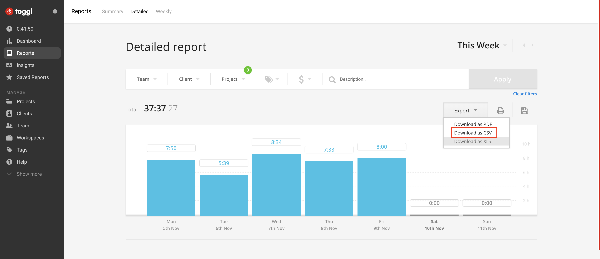

# Toggl til UBW
Konverterer Toggl-timer til en TSV som kan legges inn i [*Unngå UBW*](https://github.com/arve0/uubw).
Tidsstykker med samme beskrivelse og timekode fra samme dag blir slått sammen. Timene rundes av til nærmeste halvtime.

*Alt du trenger gjøre er å stoppe og starte klokka.* (&hellip; og å merke timene riktig).

<!-- toc -->

- [Ansvarsfraskrivelse](#ansvarsfraskrivelse)
- [Bruk](#bruk)
  * [Kjøre skriptet](#kjore-skriptet)
  * [Merking av timer](#merking-av-timer)
    + [Beskrivelse](#beskrivelse)
    + [Timekode](#timekode)
      - [Aktivitet](#aktivitet)
    + [Fravær](#fravaer)
- [Merknader](#merknader)
  * [Kan jeg ha flere merkelapper/prosjekter &hellip;?](#kan-jeg-ha-flere-merkelapperprosjekter-hellip)
  * [Avrunding](#avrunding)

<!-- tocstop -->

## Ansvarsfraskrivelse
Beklager at jeg må starte kjipt, men siden det er snakk om *mange* penger, må jeg ha det juridiske på det tørre (og omtale meg selv som *vi*, i tilfelle andre skulle bidra i fremtiden):

**Ved å bruke denne programvaren anerkjenner du at du har lest og er enig i det følgende:**
Du har selv det hele og fulle ansvaret for konsekvensene ved å bruke denne programvaren.
Vi som har laget den har ikke noe ansvar for negative konsekvenser som følge av bruk, deriblant økonomisk tap.
Bruksveiledningen er å oppfatte som en beskrivelse av hvordan programvaren er tenkt å fungere &ndash; ikke en garanti.

**Men sånn for å lette på stemninga (nå er det juridiske over) &hellip;**  
Bare se over timene før du sender dem inn, så går det nok bra.

## Bruk
### Kjøre skriptet
Vi antar at du har installert Python3.

Last ned en [detaljert rapport](https://toggl.com/app/reports/detailed/) som CSV fra Toggl: Velg tidsrommet og prosjektene som skal inn i timelisten, trykk «Export» og «Download as CSV».



Åpne en terminal og skriv:

```
$ python3 ./convert_toggl_report.py <sti til csv-fil fra toggl> <sti til tsv-fil>
```

_Eksempel:_

```
python3 ./convert_toggl_report.py  ./__test__/Toggl_time_entries_2018-10-08_to_2018-10-14.csv ./ubw.tsv
```

### Merking av timer
|Toggl desktop|UBW|
|-|-|
|||

#### Beskrivelse
Beskrivelsen i UBW blir den samme som beskrivelsen du har ført i Toggl.
Den kan stort sett være hva du vil, unntatt når det kommer til fravær (se lenger nede).

#### Timekode
Timekode-merkelapper må inneholde tekststrengen `timekode:` fulgt av UBW-timekoden. Merkelappen kan også inneholde annen tekst, så lenge den kommer *før* `timekode:`.

*Eksempel:* `fagtid julekalender timekode:32010054-3`.

##### Aktivitet
Et mindretall av arbeidsordre krever også at man fører en aktivitet

Aktivitet-merkelapper inneholder `aktivitet:` fulgt av UBW-aktivitetskoden. Som med timekoder, kan du ha annen tekst i merkelappen så lenge den kommer *før* `aktivitet:`.

*Eksempel:* `julekalender deltaker aktivitet:26`.

#### Fravær
For å merke noe som fravær må du merke den med `timekode:ABSENCE`.

*Unngå UBW* kommer til å søke på det som står i beskrivelsesfeltet, ned til hvert minste tegn. For eksempel må du reprodusere det manglende mellomrommet og andre særegenheter i `Lege, tannlege,fysioterapi besøk`.

Hvis enheten for fraværstypen føres i en annen enhet enn timer (for eksempel dager), er du nødt til å føre én time per enhet.

*Eksempel:* `timekode:ABSENCE`.

## Merknader

### Kan jeg ha flere merkelapper/prosjekter &hellip;?
Jada, du står fritt til å ha så mange merkelapper du vil og organisere Toggl-prosjektene slik du vil, så lenge det ikke kommer i kollisjon med reglene her.

### Avrunding
Skriptet følger avrundingsregelen fra norske barneskoler (under L97-læreplanen): Når det er uavgjort, runder man oppover.

*Eksempel:*

* 45 minutter og 0 sekunder rundes altså opp til en hel time
* 44 minutter og 59 sekunder rundes ned til en halvtime.

For å unngå problemer med avrunding av flyttall, bruker skriptet desimal-typen under avrundingsoperasjonene.
